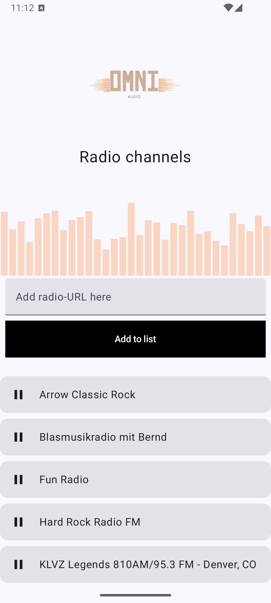

# OmniAudio

OmniAudio is a modern Android music player built with the latest Android technologies.


**Omni** means *"everything"* — the goal of this app is to bring all your audio into one place.

## Tech Stack

* Kotlin
* Jetpack Compose
* Media3
* Hilt

## Screenshots
<p align="center">
  
</p>

## Getting Started

Follow these steps to run the project locally:

1. Clone the repository

   ```bash
   git clone https://github.com/johannesl2/omniaudio-android.git
   ```

2. Open the project in Android Studio

3. Sync Gradle

4. Run the app on an emulator or physical device

## Requirements

* Android Studio (latest version recommended)
* Android SDK 34+
* Kotlin 2.0+

## Author

JohannesL2
